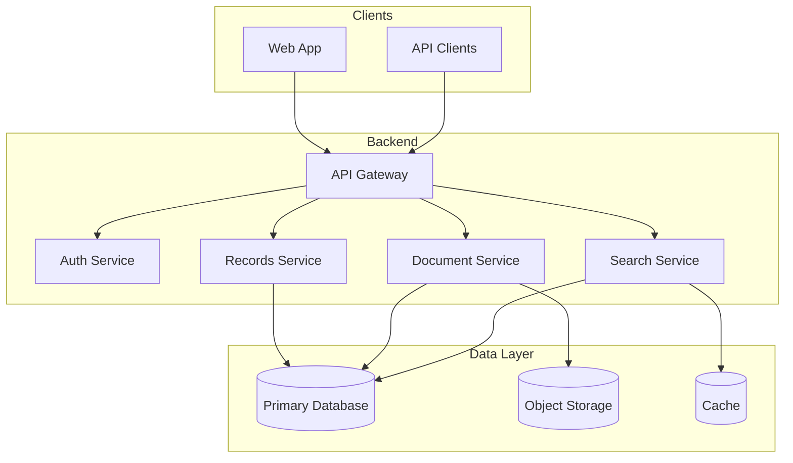

# JeevaKosha

**JeevaKosha** (जीवकोश — *life repository*) is a secure medical repository system for storing, organizing, and retrieving healthcare records. It centralizes patient data, clinical documents, and medical history so care teams can access accurate information when it matters most.

---

## Overview

Healthcare organizations generate vast amounts of data — lab reports, prescriptions, imaging, discharge summaries, and longitudinal patient histories. JeevaKosha provides a single, structured repository to manage that information with strong access controls, auditability, and search.

### Goals

- **Centralize** medical records in one trusted system
- **Organize** documents and clinical data by patient, encounter, and category
- **Retrieve** information quickly through search and filters
- **Protect** sensitive health data with role-based access and audit trails
- **Scale** from a single clinic to multi-facility deployments

---

## Features

### Core

| Feature | Description |
|--------|-------------|
| **Patient profiles** | Demographics, identifiers, and linked medical records |
| **Medical history** | Allergies, conditions, medications, immunizations, and visit timeline |
| **Document repository** | Upload, tag, and version lab reports, imaging, prescriptions, and clinical notes |
| **Search & discovery** | Full-text and structured search across patients and documents |
| **Encounter tracking** | Visits, admissions, and procedures tied to specific dates and providers |

### Security & compliance

| Feature | Description |
|--------|-------------|
| **Role-based access** | Separate permissions for patients, clinicians, nurses, and administrators |
| **Audit logging** | Who accessed or changed what, and when |
| **Data encryption** | Encryption in transit and at rest for protected health information |
| **Consent management** | Record and enforce patient consent for data sharing |

### Planned

- FHIR-compatible APIs for interoperability
- Integration with lab and imaging systems
- Patient portal for viewing own records
- Analytics dashboards for operational insights

---

## Architecture



---

## Tech stack

> Update this section as implementation choices are finalized.

| Layer | Technology |
|-------|------------|
| **Database** | MongoDB |
| **Backend** | TBD |
| **Frontend** | React + Vite (medintel UI) |
| **File storage** | TBD (e.g. S3-compatible object storage) |
| **Authentication** | TBD (e.g. JWT, OAuth 2.0) |

---

## Project structure

```
JeevaKosha/
├── README.md
├── docs/              # Architecture, API specs, compliance notes
├── backend/           # API and business logic
├── frontend/          # Web application
└── scripts/           # Setup, migration, and utility scripts
```

---

## Getting started

### Prerequisites

- Node.js 20+ (or runtime for your chosen stack)
- MongoDB 6+
- Git

### Installation

```bash
# Clone the repository
git clone https://github.com/your-org/jeevakosha.git
cd jeevakosha

# Install frontend dependencies
cd frontend && npm install

# Copy environment template and configure
# cp .env.example .env
```

### Environment variables

Create a `.env` file in the project root (or per service) with at least:

```env
# Database
MONGODB_URI=mongodb://localhost:27017/jeevakosha

# Application
NODE_ENV=development
PORT=3000

# Security (generate strong secrets in production)
JWT_SECRET=your-secret-key
ENCRYPTION_KEY=your-encryption-key
```

### Run locally

```bash
# Start MongoDB (if not already running)
# mongod

# Start backend (from project root)
python -m uvicorn backend.main:app --reload --port 8000

# Start frontend
cd frontend && npm run dev
```

---

## API overview

REST (or GraphQL) endpoints will be documented here as they are implemented. Planned resource groups:

- `/auth` — login, refresh, logout
- `/patients` — CRUD and search
- `/records` — medical history and clinical data
- `/documents` — upload, download, metadata
- `/encounters` — visits and admissions
- `/audit` — access and change logs (admin)

---

## Security & privacy

JeevaKosha is designed with healthcare data protection in mind:

- **Least privilege** — users see only what their role requires
- **Auditability** — sensitive actions are logged
- **No secrets in repo** — use environment variables and secret managers
- **Compliance readiness** — structure supports alignment with applicable regulations (e.g. HIPAA, local health data laws); formal compliance requires legal review and operational controls

Do not commit `.env` files, credentials, or real patient data.

---

## Contributing

1. Fork the repository
2. Create a feature branch: `git checkout -b feature/your-feature`
3. Commit changes with clear messages
4. Open a pull request with a short description and test notes

Please avoid including PHI (protected health information) in issues, PRs, or test fixtures.

---

## Roadmap

- [ ] Project scaffolding (backend, frontend, database)
- [ ] Authentication and role-based access
- [ ] Patient and record CRUD
- [ ] Document upload and retrieval
- [ ] Search and filtering
- [ ] Audit logging
- [ ] API documentation (OpenAPI/Swagger)
- [ ] Patient portal
- [ ] FHIR interoperability

---

## License

TBD — add your chosen license (e.g. MIT, Apache 2.0, or proprietary).

---

## Contact

For questions or collaboration, open an issue or contact the maintainers.

---

*JeevaKosha — preserving life’s medical story, securely.*
